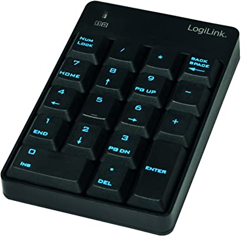
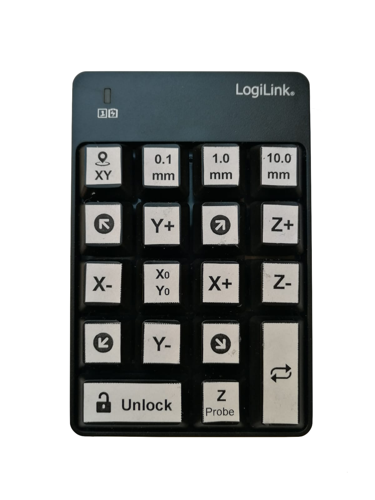
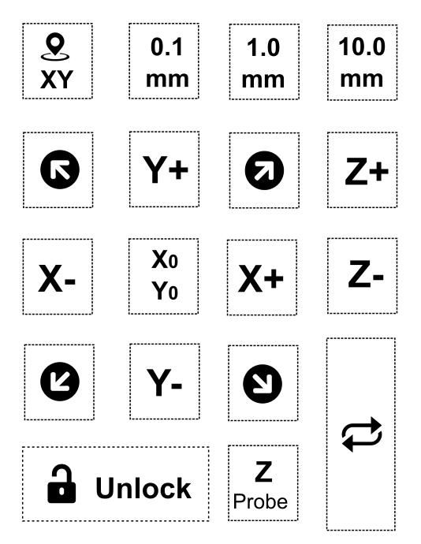

# cncjs-pendant-numpad
A simple pendant for using cncjs with a num pad (as Wireless/USB Input). The code is based on [cncjs-pendant-keyboard](https://github.com/cncjs/cncjs-pendant-keyboard)






--

NOTICE: Tested with LogiLink num pad  on Linux/Raspbian (Raspberry Pi).
(default options are set to LogiLink vendor- and productID, see description below for running with other vendors/products)

--
## Installation

Make sure you have installed the following packages

```
libusb-1.0-0-dev
libudev-dev
```
These can be installed with apt-get.

After cloning the repository to your work directory, change into this directory and run

```
npm install
```

## Add device Rules for non-root users

Some additional configurations are needed for making the device working for non-root users.

First create a new file called 

```
/etc/udev/rules.d/50-hid.rules
``` 

add the following line as content, which grants access to the hid device for non-root users.

```
KERNEL=="hidraw*", GROUP="input", MODE="0660"`
```

Then run the following command for making the changes work ( a reboot will also do this job).

```
sudo udevadm trigger
```


## Usage
Run `bin/cncjs-pendant-numpad` to start. Pass --help to `cncjs-pendant-numpad` for more options.

```
bin/cncjs-pendant-numpad --help
```

Hotkeys:

|     Key    	|           Function           	|
|:----------:	|:----------------------------:	|
| NUM  LOCK  	| zero out work offset x and y 	|
| /          	| step in 0.1 units            	|
| *          	| step in 1.0 units            	|
| Back Space 	| step in 10.0 units           	|
| 7 (HOME)   	| move -X and +Y               	|
| 8 (UP)     	| move +Y                      	|
| 9 (PG UP)  	| move +X and +Y               	|
| 4 (LEFT)   	| move -X                      	|
| 5          	| repeat last action           	|
| 6 (RIGHT)  	| move +X                      	|
| 1 (END)    	| move -X and -Y               	|
| 2 (DOWN)   	| move -Y                      	|
| 3 (PG DN)  	| move +X and -Y               	|
| 0 (INS)    	| unlock ($X GRBL)                       	|
| . (DEL)    	| probe tool offset            	|
| -          	| z axis up                    	|
| +          	| z axis down                  	|
| ENTER      	| home X and Y                 	|



You can download a SVG file for labels [here](docs/key_labels.svg).

### Probe Offset
The probe offset default is set to 1.56 mm ( i am using a piece of PCB with a thickness of 1.56 mm). You can override this by giving the pendant
an extra start parameter for probe offset.

```
--probeoffset <value>
```

### Using with other Num Pad's than LogiLink

Because the keycodes for HID devices are the same for all keyboards, this should also work with 
other Numpad's than LogiLink. Just find out the vendorID and productID of your device and
start the pendant with --vendorid and --productid parameter.

Just run the following command to find out the vendor- and productId of your device

```
lsusb
```
The output might look like 

```
Bus 001 Device 004: ID 062a:4101 MosArt Semiconductor Corp. Wireless Keyboard/Mouse
```

In this example the vendorID is 0x062a and the productID 0x4101. So you you need
to start the pendant with the following additional parameters

```
--vendorid 0x062a --productid 0x4101
```
